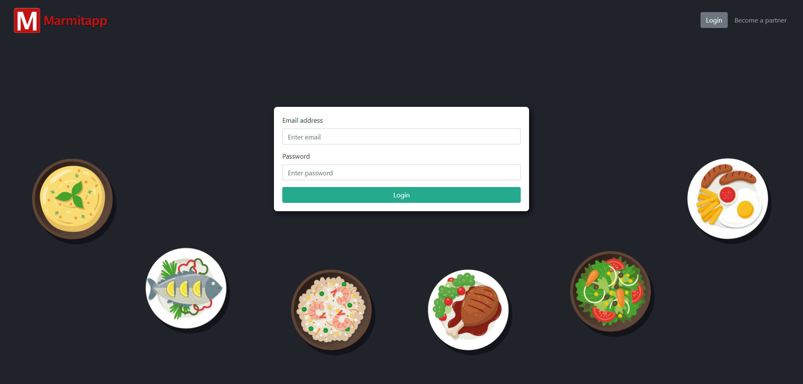
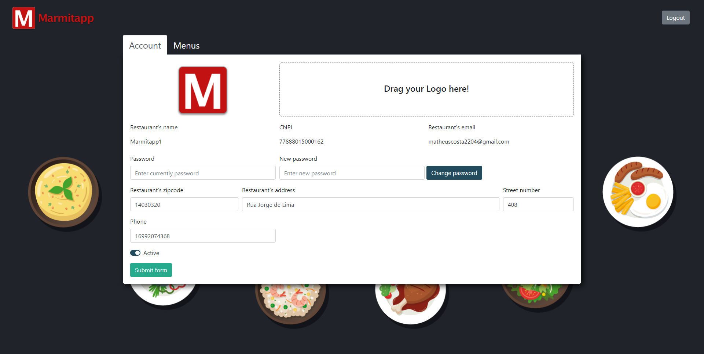
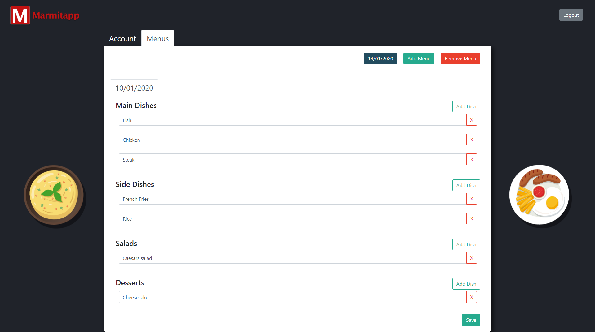

# Marmitapp Admin

Marmitapp is a project to help people to find their wish menu. (It is not a delivery food). The hole project is divided in 3 parts

API - ExpressJs
Web Admin - ReactJs
Mobile App - React Native

## Demo






## Installation

First, clone the repo in your machine using git

```bash
git clone https://github.com/matheuscosta2204/marmitapp-admin.git && cd marmitapp-admin
```

Second, install node_modules using npm or yarn

NPM
```bash
npm install
```

YARN
```bash
yarn
```

Third, to start running

```bash
yarn start
```

## Contributing
Pull requests are welcome. For major changes, please open an issue first to discuss what you would like to change.

Please make sure to update tests as appropriate.

## License
[MIT](https://choosealicense.com/licenses/mit/)